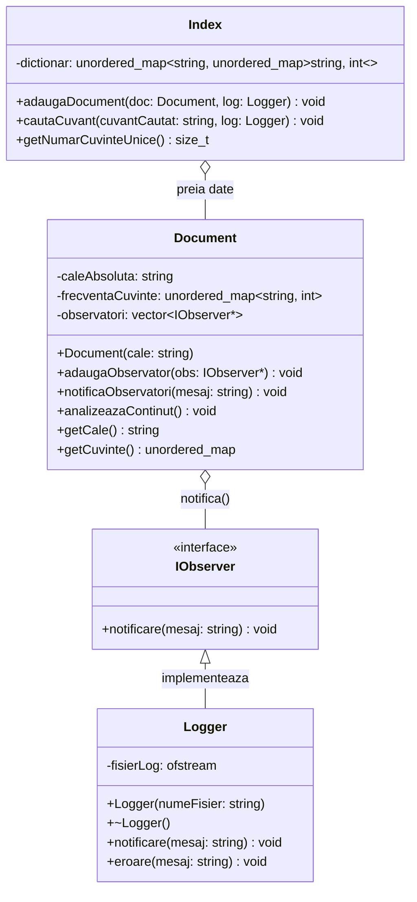

# Documentație Proiect POO - Motor de Căutare

## 1. Descrierea Proiectului
Acest proiect implementează un motor de căutare local, oferind capabilități de indexare text ultra-rapidă și interogare instantanee, folosind concepte avansate de Programare Orientată pe Obiecte (POO) în C++17. Sistemul parcurge recursiv fișierele dintr-un director, extrage cuvintele valide prin intermediul unui filtru NLP (eliminând cuvintele de legătură) și creează un *Inverted Index* (Index Inversat). Aplicația este rulată prin intermediul unui meniu interactiv (CLI) optimizat pentru viteză și eficiență a memoriei.

## 2. Concepte POO Folosite

* **Clase și Obiecte:** Funcționalitatea este divizată logic: clasa `Index` (gestionează structura globală de date și algoritmii de căutare), `Document` (încapsulează informațiile și logica de parsare la nivelul unui fișier individual) și `Logger` (se ocupă de persistența evenimentelor).
* **Încapsulare (Encapsulation):** Atributele critice (ex. dicționarul din `Index`, calea și frecvența cuvintelor din `Document`) sunt protejate sub eticheta `private` pentru a preveni alterarea stării interne. Ele sunt accesate și modificate strict prin metode publice controlate (getter/setter).
* **Moștenire și Polimorfism (Design Pattern-ul Observer):**
    Aplicația folosește un sistem arhitectural de tip *Observer*. Interfața pur abstractă `IObserver` forțează clasele derivate să implementeze metoda de actualizare. Clasa `Logger` extinde această interfață (`class Logger : public IObserver`) și se "abonează" la obiectele de tip `Document` și `Index`. Când are loc un eveniment (analizare finalizată, cuvânt căutat), subiectul notifică toți observatorii fără a ști detalii concrete despre ei (Late Binding / Polimorfism la Runtime).
* **Utilizarea STL (Standard Template Library):** Baza motorului de căutare este structura `std::unordered_map` (Tabelă de Dispersie / Hash Table). Am ales această structură în favoarea unui simplu `std::map` deoarece oferă un timp de căutare constant $O(1)$, vital pentru volume de nivelul Gigabytes. De asemenea, se folosește `std::unordered_set` pentru filtrul NLP.

## 3. Optimizări Majore (Viteză și Memorie)
Acest proiect a fost modificat special pentru a suporta indexarea de date la scară mare (testat pe volume > 5 GB), evitând epuizarea memoriei RAM:

1.  **Buffered I/O (Citire Binară în Blocuri):** S-a abandonat metoda clasică `std::getline`, care este predispusă la realocări masive de memorie pe texte fără Newline. În schimb, clasa `Document` deschide fișierul folosind parametrul `std::ios::binary` și "mușcă" fix $1 \text{ MB}$ de date o dată de pe disc, procesează textul în RAM și preia următorul bloc. Acest lucru reduce latența sistemului de operare și blochează consumul de RAM strict la dimensiunea bufferului, indiferent de dimensiunea fișierului.
2.  **Filtru NLP (Stop Words In-Memory):** Aplicația ignoră automat orice cuvânt sub 3 litere și utilizează un `std::unordered_set` static declarat în interiorul funcției de analiză. Lista elimină conjuncțiile și cuvintele de legătură (ex: "este", "pentru", "daca", "care"), curățând indexul global de zeci de milioane de intrări redundante.
3.  **Optimizarea Căutării:** Timpul de căutare nu depinde de volumul de date indexate. Folosind hashing, complexitatea căutării unui termen este $O(1)$. 

## 4. Code Flow și Execuție

### 4.1. Fluxul de Inițializare și Indexare
```text
main() 
  ↓
Inițializare Logger (creare fisier motor_cautare.log)
  ↓
Meniu Interactiv -> Utilizatorul alege [1] Indexare și introduce calea
  ↓
Parcurgere recursivă (std::filesystem::recursive_directory_iterator)
  ├─→ Identificare exclusivă fișiere .txt
  ├─→ Pentru fiecare fișier:
       ├─→ Creare obiect Document
       ├─→ document.adaugaObservator(&logger)
       ├─→ document.analizeazaContinut() (Buffered I/O 1MB chunk reading)
       │    ├─→ Normalizare text (to_lower, eliminare punctuație)
       │    └─→ Filtrare NLP (ignorare cuvinte scurte & stop words)
       └─→ index.adaugaDocument(document) -> integrare map local în index global
  ↓
Întoarcere în Meniu
```

### 4.1. Fluxul de Căutare (Search Query)
```text
Meniu Interactiv -> Utilizatorul alege [2] Căutare (dacă indexul este valid)
  ↓
User input: '<cuvânt_căutat>'
  ├─→ Verificare comandă '!meniu' -> exit loop
  ├─→ Normalizare (lowercase)
  ├─→ Filtru 1: Este cuvântul mai scurt de 3 litere? -> Afișare Info (A fost filtrat la indexare)
  ├─→ Filtru 2: Este în lista de Stop Words? -> Afișare Info (Ignorat pt optimizare)
  └─→ Index::cautaCuvant()
       ├─→ index.dictionar.find(cuvânt) -> O(1)
       ├─→ Dacă există: Iterare peste rezultate (Nume Document + Frecvență)
       └─→ Notificare Logger prin Polimorfism
  ↓
Afișare formatată în consolă
```
### 5. Caracteristici ale Interfeței Utilizator (Meniu CLI)
* **Protecție la Erori:** Meniul nu permite utilizatorului să efectueze o căutare (Opțiunea 2) sau să ceară statistici (Opțiunea 3) dacă nu a fost indexat în prealabil niciun director.
* **Feedback NLP (Stop-Words):** Dacă utilizatorul încearcă să caute un cuvânt ignorat intenționat de sistem (ex. "pentru"), sistemul nu returnează un simplu "Nu a fost găsit", ci educă utilizatorul afișând mesajul: "[INFO] 'pentru' este un cuvant de legatura (Stop Word). Sistemul l-a ignorat pentru a optimiza memoria RAM."
* **Monitorizarea Performanței:** Meniul dispune de un modul integrat de analiză (Opțiunea 3) ce afișează numărul de documente procesate, timpul în milisecunde și dimensiunea reală a structurii Hash din RAM (numărul de cuvinte unice învățate).

### 6. Diagramă UML 


